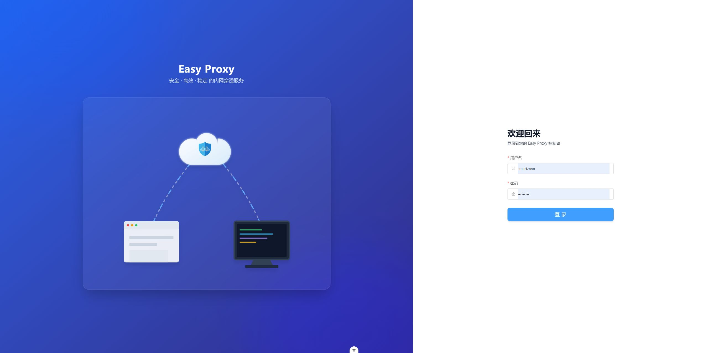
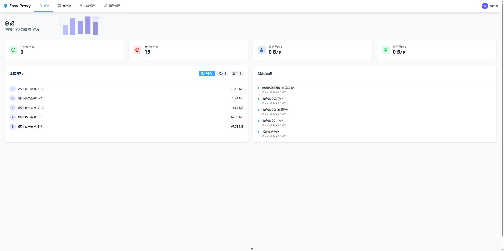

[English](./README_en.md) | 中文

# Easy Proxy

<p align="center">
  
</p>

一个简单、高效的内网穿透工具。

## 项目简介

Easy Proxy 是一个基于 Vert.x 开发的高性能内网穿透工具，支持 TCP 流量转发。它包含服务端、客户端和 Web 管理界面，旨在提供简单易用的内网穿透服务。


## 项目结构

- `easy-proxy-server`: 服务端，负责处理客户端连接、请求转发和 Web 管理 API。
- `easy-proxy-client`: 客户端，部署在内网，负责与服务端建立连接并转发本地服务流量。
- `easy-proxy-web`: Web 管理界面，基于 Vue 3 + Element Plus 开发。
- `easy-proxy-common`: 公共模块，包含通用的工具类和数据模型。

## 软件截图

<p align="center">
  
  
</p>

## 环境要求

- JDK 17
- Maven 3.6.0+
- Node.js 20+ (用于 Web 端开发)

## 快速开始

### 服务端部署 (Server)

```bash
# ubuntu
sudo ufw allow 10090/tcp  # 代理端口
sudo ufw allow 10093/tcp  # Web 管理端口
```

```bash
# api服务
docker rm -f easy-proxy-server
docker run -d \
  --name easy-proxy-server \
  --network host \
  -v $(pwd)/easy-proxy-server/config:/app/config \
  -v $(pwd)/easy-proxy-server/data:/app/data \
  yudejijie/easy-proxy-server:v0.1.0

# web管理界面
docker rm -f easy-proxy-web
docker run -d \
  --name easy-proxy-web \
  --network host \
  yudejijie/easy-proxy-web:v0.1.0
```

### 客户端部署 (Client)

```bash
# 客户端服务
docker run -d \
  --name easy-proxy-client \
  --network host \
  -v $(pwd)/easy-proxy-client/config:/app/config \
  yudejijie/easy-proxy-client:latest
```

## 技术栈

- **后端**: Java 17, Vert.x 4
- **前端**: Vue 3, TypeScript, Element Plus, Vite
- **构建工具**: Maven, npm
