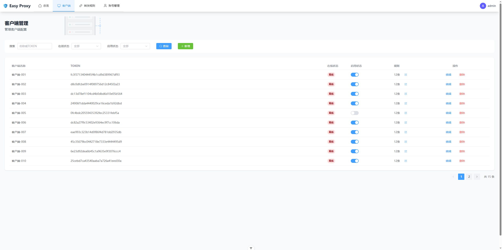

English | [中文](./README.md)

## Easy Proxy

Easy Proxy is a high-performance intranet penetration tool developed based on Vert.x, supporting TCP traffic forwarding. It includes a server, a client, and a Web management interface, aiming to provide easy-to-use intranet penetration services.

<p align="center">
  
</p>

## Screenshots

<p align="center">
  
  
</p>

## Core Features

| Feature | Description | Status |
| :---------- | :------------------------------------------------ | :---- |
| **TCP Intranet Penetration** | Based on Vert.x event-driven model, achieves high-performance TCP traffic forwarding, supports bidirectional data transparent transmission, suitable for various TCP application scenarios. | ✅ Supported |
| **TLS Encrypted Transmission** | Supports TLS encryption for server-client communication, automatically generates/downloads certificates to prevent data eavesdropping or tampering during transmission. | ✅ Supported |
| **Flow Control Management** | Supports rule-based bandwidth limiting (KB/s) and connection count limiting, adopts token bucket algorithm to precisely control traffic rate and prevent abuse. | ✅ Supported |
| **Traffic Analysis** | Provides multi-dimensional traffic statistics, supports connection monitoring and historical report queries, helping users understand traffic trends. | ✅ Supported |
| **Dynamic Port Management** | Supports dynamic application/release of ports via Web interface, taking effect in real-time without restarting the service, flexibly coping with business changes. | ✅ Supported |
| **Multi-Account Management** | Supports multi-user management, providing a visual user management interface to ensure system security. | ✅ Supported |

## Docker Quick Deployment

### Server Deployment

```bash
# api server
docker rm -f easy-proxy-server
docker run -d \
  --name easy-proxy-server \
  --network host \
  --restart always \
  -v $(pwd)/easy-proxy-server/config:/app/config \
  -v $(pwd)/easy-proxy-server/data:/app/data \
  -v $(pwd)/easy-proxy-server/logs:/app/logs \
  yudejijie/easy-proxy-server:latest

# web management interface
docker rm -f easy-proxy-web
docker run -d \
  --name easy-proxy-web \
  --network host \
  --restart always \
  yudejijie/easy-proxy-web:latest
```

#### Configuration Process

1. Access `http://server-ip:10093` to open the Web management interface. (**server-ip is the server IP**)
2. Initialize the administrator account.
3. Create a new client and generate a token. (**The client needs to use this token to establish a connection with the server**)
4. Create a new forwarding rule, specifying the public port and the client forwarding address.

### Client Deployment

```bash
# client service
docker run -d \
  --name easy-proxy-client \
  --network host \
  --restart always \
  -v $(pwd)/easy-proxy-client/config:/app/config \
  -v $(pwd)/easy-proxy-client/logs:/app/logs \
  yudejijie/easy-proxy-client:latest
```

#### Configuration Process

1. After the service starts successfully, a `config.yaml` file will be generated in the `config` directory.
2. Modify the `config.yaml` file to configure the server address and token.

```yaml
server:
  address: "server-ip" # server ip
  port: 10092
  token: "client-token" # client token
```

1. Restart the client service to make the configuration take effect.
```bash
docker restart easy-proxy-client
```
2. Check the management configuration page, the client should be online. (If not online, check Troubleshooting)

## Troubleshooting

### Server inaccessible, proxy service inaccessible

1. Ensure the firewall or security policy opens the corresponding ports.
- Port 10090: Traffic forwarding port
- Port 10092: Web management page port
- Proxy Port: Open the corresponding public port according to the configured forwarding rules.

### Client unable to connect to server

1. Ensure the client is configured with the correct server address and token.

## Tech Stack

- **Backend**: Java 17, Vert.x 4
- **Frontend**: Vue 3, TypeScript, Element Plus, Vite
- **Build Tools**: Maven, npm
